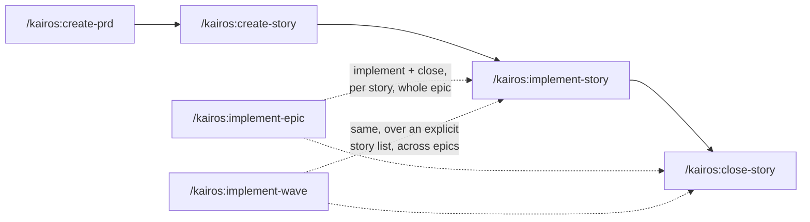

# Kairos

**A story-driven agile workflow for [Claude Code](https://claude.com/claude-code) — built for solo devs and small teams working on projects that already exist.**

> Background: [Kairos — a spec-driven workflow for existing projects](https://sylvain.artois.io/tech/kairos-spec-driven-workflow) (blog post).

## Quickstart (5 minutes)

```bash
# 1. Add the marketplace, then install the plugin
/plugin marketplace add sylvain-artois/kairos-claude-code-workflow
/plugin install kairos@kairos

# 2. In your project root, bootstrap Kairos (read-only detection, writes only spec.md)
/kairos:init

# 3. Capture an initiative and slice it into stories
/kairos:create-prd "add CSV export to the reports page"
/kairos:create-story            # decomposes the PRD into STORY-NNN files

# 4. Build and ship one story
/kairos:implement-story STORY-001
/kairos:close-story STORY-001   # tests + QA + review + commit, per your push_mode

# 5. Later — pull a new Kairos version (restart Claude Code to apply)
/plugin marketplace update kairos
/plugin update kairos@kairos
```

Full walkthrough: **[docs/quickstart.md](docs/quickstart.md)**.

## Why it exists

Most spec-driven tools assume a greenfield. Kairos assumes the opposite: you have code, conventions, tests, and a backlog in your head. It gives you a handful of slash commands to turn an idea into a PRD, slice it into stories, implement them, and ship — without leaving your editor.



Setup once with `/kairos:init` (and `/kairos:setup-worktree-isolation` if you use worktrees); `/kairos:worktree` opens the tree an epic runs in; `/kairos:create-test-plan`, `/kairos:qa`, `/kairos:review`, `/kairos:spec`, and `/kairos:release` round out the loop.

- **Existing projects, not greenfield.** `/kairos:init` reads your repo (services, test commands, VCS, branch) and writes a `spec.md` you'd have written by hand. No rewrite, no migration.
- **A QA layer between unit tests and humans.** `/kairos:qa` runs per-service test plans — the pre-human check most workflows skip.
- **A small, composable command set.** A four-command core (PRD → story → implement → close), plus opt-in commands for epics, waves, worktree isolation, QA, and releases. No `.kairos/` cache, no config anywhere but `spec.md`. The one piece of runtime state — the [gate receipts](docs/gate-receipts.md) — lives outside your repository, never in it.

## Issue tracking (opt-in)

Kairos can mirror your PRDs and stories onto GitHub milestones and issues, so that **agents read the files and humans read GitHub**. Stories stay versioned in the repo — that's what an agent loads at the commit it works from; GitHub carries assignment, state and the overview — that's what a teammate opens on a Monday morning. It's the setup you want when someone on the team owns the domain but not the codebase.

A PRD becomes a milestone titled with its slug, `STORY-042` becomes an issue titled `STORY-042 — …`, and the issue number is written back into the story file. That single line is the whole mechanism: **no correspondence table, no state file, no cache** — the mapping lives in git. Issues are created the moment the story is, `Closes #42` in the pull request closes them at merge, and `/kairos:sync-pm` reconciles anything missed. Content flows one way, files → GitHub; `/kairos:create-story --from-issue 57` is the one door back, turning an issue written by a non-developer into a story an agent can implement.

Turn it on by re-running `/kairos:init` — it asks once, and only when `gh` is installed and authenticated. Off by default: leave it off and no command ever touches the network. Details: **[docs/github-issue-tracking.md](docs/github-issue-tracking.md)**.

## The commands

| Command | What it does |
|---|---|
| [`/kairos:init`](skills/init/SKILL.md) | Detect your project, write `spec.md` (idempotent, never touches your files) |
| [`/kairos:create-prd`](skills/create-prd/SKILL.md) | Turn an idea into a product requirements doc |
| [`/kairos:create-story`](skills/create-story/SKILL.md) | Decompose a PRD into independent, shippable stories |
| [`/kairos:implement-story`](skills/implement-story/SKILL.md) | Implement one story (worktree opt-in; no commits — that's close-story's job) |
| [`/kairos:implement-epic`](skills/implement-epic/SKILL.md) | Run a whole epic in one shared worktree — implement + close each story in sequence, then push/PR once at the end |
| [`/kairos:implement-wave`](skills/implement-wave/SKILL.md) | Run an explicit list of stories — crossing epics on purpose — as one unit: one worktree, one branch, one PR |
| [`/kairos:close-story`](skills/close-story/SKILL.md) | Test → QA → review → commit → push/PR → archive |
| [`/kairos:create-test-plan`](skills/create-test-plan/SKILL.md) | Generate a runnable QA test plan for a service |
| [`/kairos:qa`](skills/qa/SKILL.md) | Execute a service's test plans, report pass/fail |
| [`/kairos:review`](skills/review/SKILL.md) | Review a diff scope against the review contract — the default reviewer `close-story` calls |
| [`/kairos:spec`](skills/spec/SKILL.md) | Maintain a service's `spec.md` — backfill from code, or compact it when it inflates |
| [`/kairos:sync-pm`](skills/sync-pm/SKILL.md) | Reconcile the GitHub issue mirror with the story files (opt-in; see below) |
| [`/kairos:worktree`](skills/worktree/SKILL.md) | Create, join, or tear down a worktree — the entry point of every `epic_shared` run |
| [`/kairos:setup-worktree-isolation`](skills/setup-worktree-isolation/SKILL.md) | One-time Compose rewrite so worktree test runs never collide with prod (prereq for worktree mode) |
| [`/kairos:release`](skills/release/SKILL.md) | Analyze commits, write a release note, tag it, push |

Commands are interactive — they ask before doing anything irreversible. You rarely need the docs below; they're here when you want the *why*.

## How it compares

Kairos owes a lot to the projects that mapped this space first — go look at them, one may fit you better:

- **[BMAD-METHOD](https://github.com/bmad-code-org/BMAD-METHOD/)** — a richer agentic method, strongest on greenfield.
- **[openspec.dev](https://openspec.dev)** — rigorous spec-driven development, also greenfield-leaning.
- **[CCPM](https://github.com/automazeio/ccpm)** — GitHub-Issues-centric project management. Kairos mirrors onto issues too, but the other way round: the files stay authoritative and the tracker is a view of them.

Kairos's niche: **existing projects, a pre-human QA layer, and staying small.** It sits upstream of your Claude Code / CI flow — it produces the PRDs, stories, branches and PRs; your existing pipeline takes it from there.

## Learn more

- [Kairos — a spec-driven workflow for existing projects](https://sylvain.artois.io/tech/kairos-spec-driven-workflow) — the story behind the design (blog post).
- [docs/concepts.md](docs/concepts.md) — the model in one page (workspace vs service, the two specs, worktrees, QA, push mode).
- [docs/spec-format.md](docs/spec-format.md) — the `spec.md` reference.
- [docs/dependencies.md](docs/dependencies.md) — the dependency graph: what PRDs and stories declare, and what a third-party planner can derive from it.
- [docs/review-contract.md](docs/review-contract.md) — pluggable code review (the default `/kairos:review`, your slash command, or a script).
- [docs/gate-receipts.md](docs/gate-receipts.md) — why a gate that ran and a gate that didn't look identical, and the receipt that tells them apart.
- [docs/github-issue-tracking.md](docs/github-issue-tracking.md) — the opt-in GitHub mirror: mapping, inbound path, and what it deliberately doesn't do.
- [docs/examples/](docs/examples/) — filled-in specs, a test plan, a review command.

## Contributing & license

The plugin is just Markdown command definitions — see [CONTRIBUTING.md](CONTRIBUTING.md). Licensed under [MIT](LICENSE).
