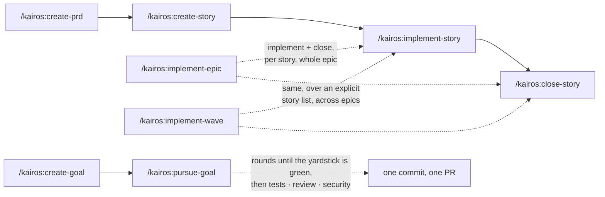

# Kairos

**Two agentic workflows for [Claude Code](https://claude.com/claude-code), driven by one `spec.md` — story-driven delivery with gates, and goal-driven pursuit against an executable yardstick. Built for solo devs and small teams working on projects that already exist.**

> Background: [Kairos — a spec-driven workflow for existing projects](https://sylvain.artois.io/tech/kairos-spec-driven-workflow) (blog post).

## Quickstart (5 minutes)

```bash
# 1. Add the marketplace, then install the plugin
/plugin marketplace add sylvain-artois/kairos-claude-code-workflow
/plugin install kairos@kairos

# 2. In your project root, bootstrap Kairos (read-only detection, writes only spec.md)
/kairos:init

# 3. Capture an initiative and slice it into stories
/kairos:create-prd "add CSV export to the reports page"
/kairos:create-story            # decomposes the PRD into STORY-NNN files

# 4. Build and ship one story
/kairos:implement-story STORY-001
/kairos:close-story STORY-001   # tests + QA + review + commit, per your push_mode

# 5. Later — pull a new Kairos version (restart Claude Code to apply)
/plugin marketplace update kairos
/plugin update kairos@kairos
```

Full walkthrough: **[docs/quickstart.md](docs/quickstart.md)**.

## New in 2.0 — the goal flow

Kairos 2.0 adds a second way to work, in the spirit of the agent loops everyone is talking about right now. In the story flow, **you trace the path**: PRD → stories → acceptance criteria, each story gated on its way in. In the goal flow, **you fix the destination and the walls, and the agent chooses its route**:

```
/kairos:create-goal "sign-in lands on the dashboard, and no session lookup outside the two auth routes"
/kairos:pursue-goal sign-in-lands-on-dashboard
```

`/kairos:create-goal` writes two files: `GOAL.md` (a contract of observable assertions, the invariants that must not break, the terrain) and `measure.sh`, **the yardstick**. It runs the yardstick once on the current code and refuses to save the goal as ready until every assertion is red and every invariant green. `/kairos:pursue-goal` then loops. Each round, a fresh generator agent takes two or three red rows and works on them. After every round the orchestrator re-runs the yardstick itself and never takes the agent's word for the score. Once the yardstick is green, an evaluator agent judges the tree: it re-runs the verifiers, audits the tests the generator wrote, and rules on what no script can decide. The run ends through the same gates as a story (tests, review, security), with one commit and one PR. A lock on the contract, a scope check and a round budget turn a loop into something you can leave running.

**A word of honesty:** the goal flow is very new. It has run on real projects, but it has not been measured to the standard the story flow has (see [How Kairos is measured](#how-kairos-is-measured)), and its shape will move. I adopted it immediately anyway, and it is now how I start most work that has a clear finish line. **The story flow is not going anywhere:** I keep maintaining it, and it remains the better tool when the path matters as much as the destination, when a teammate needs to follow the backlog, or when the work is best sliced up front.

Details: **[docs/goals.md](docs/goals.md)**.

## Why it exists

Most spec-driven tools assume a greenfield. Kairos assumes the opposite: you have code, conventions, tests, and a backlog in your head. It gives you a handful of slash commands to turn an idea into a PRD, slice it into stories, implement them, and ship — without leaving your editor.



Setup once with `/kairos:init` (and `/kairos:setup-worktree-isolation` if you use worktrees); `/kairos:worktree` opens the tree an epic or a goal runs in; `/kairos:create-test-plan`, `/kairos:qa`, `/kairos:review`, `/kairos:spec`, and `/kairos:release` round out the loop.

- **Existing projects, not greenfield.** `/kairos:init` reads your repo (services, test commands, VCS, branch) and writes a `spec.md` you'd have written by hand. No rewrite, no migration.
- **A QA layer between unit tests and humans.** `/kairos:qa` runs per-service test plans — the pre-human check most workflows skip.
- **A small, composable command set.** A four-command story core (PRD → story → implement → close), a two-command goal flow (goal → pursue), plus opt-in commands for epics, waves, worktree isolation, QA, and releases. No `.kairos/` cache, no config anywhere but `spec.md`. The one piece of runtime state — the [gate receipts](docs/gate-receipts.md) — lives outside your repository, never in it.

## Issue tracking (opt-in)

Kairos can mirror your PRDs and stories onto GitHub milestones and issues, so that **agents read the files and humans read GitHub**. Stories stay versioned in the repo — that's what an agent loads at the commit it works from; GitHub carries assignment, state and the overview — that's what a teammate opens on a Monday morning. It's the setup you want when someone on the team owns the domain but not the codebase.

A PRD becomes a milestone titled with its slug, `STORY-042` becomes an issue titled `STORY-042 — …`, and the issue number is written back into the story file. That single line is the whole mechanism: **no correspondence table, no state file, no cache** — the mapping lives in git. Issues are created the moment the story is, `Closes #42` in the pull request closes them at merge, and `/kairos:sync-pm` reconciles anything missed. Content flows one way, files → GitHub; `/kairos:create-story --from-issue 57` is the one door back, turning an issue written by a non-developer into a story an agent can implement.

Turn it on by re-running `/kairos:init` — it asks once, and only when `gh` is installed and authenticated. Off by default: leave it off and no command ever touches the network. Details: **[docs/github-issue-tracking.md](docs/github-issue-tracking.md)**.

## The commands

| Command | What it does |
|---|---|
| [`/kairos:init`](skills/init/SKILL.md) | Detect your project, write `spec.md` (idempotent, never touches your files) |
| [`/kairos:create-prd`](skills/create-prd/SKILL.md) | Turn an idea into a product requirements doc |
| [`/kairos:create-story`](skills/create-story/SKILL.md) | Decompose a PRD into independent, shippable stories |
| [`/kairos:implement-story`](skills/implement-story/SKILL.md) | Implement one story (worktree opt-in; no commits — that's close-story's job) |
| [`/kairos:implement-epic`](skills/implement-epic/SKILL.md) | Run a whole epic in one shared worktree — implement + close each story in sequence, then push/PR once at the end |
| [`/kairos:implement-wave`](skills/implement-wave/SKILL.md) | Run an explicit list of stories — crossing epics on purpose — as one unit: one worktree, one branch, one PR |
| [`/kairos:close-story`](skills/close-story/SKILL.md) | Test → QA → review → commit → push/PR → archive |
| [`/kairos:create-goal`](skills/create-goal/SKILL.md) | Turn an objective into `GOAL.md` (contract, invariants, terrain) and `measure.sh`, the yardstick, verified red on the current code |
| [`/kairos:pursue-goal`](skills/pursue-goal/SKILL.md) | Pursue a goal in rounds of a fresh generator, re-measured after each; one evaluator pass on green; then the gates, one commit, one PR |
| [`/kairos:create-test-plan`](skills/create-test-plan/SKILL.md) | Generate a runnable QA test plan for a service |
| [`/kairos:qa`](skills/qa/SKILL.md) | Execute a service's test plans, report pass/fail |
| [`/kairos:review`](skills/review/SKILL.md) | Review a diff scope against the review contract — the default reviewer `close-story` calls |
| [`/kairos:spec`](skills/spec/SKILL.md) | Maintain a service's `spec.md` — backfill from code, or compact it when it inflates |
| [`/kairos:sync-pm`](skills/sync-pm/SKILL.md) | Reconcile the GitHub issue mirror with the story files (opt-in; see below) |
| [`/kairos:worktree`](skills/worktree/SKILL.md) | Create, join, or tear down a worktree — the entry point of every `epic_shared` run |
| [`/kairos:setup-worktree-isolation`](skills/setup-worktree-isolation/SKILL.md) | One-time Compose rewrite so worktree test runs never collide with prod (prereq for worktree mode) |
| [`/kairos:release`](skills/release/SKILL.md) | Analyze commits, write a release note, tag it, push |

Behind `/kairos:close-story` sit three forked gates — `/kairos:gate-tests`, `/kairos:gate-security` and `/kairos:spec-update` — each run in its own context and aimed at an explicit work tree. `/kairos:implement-epic` and `/kairos:implement-wave` delegate every story to two agents, `kairos-implement` then `kairos-close`, so the orchestrator's context grows by summaries, not by code. `/kairos:pursue-goal` does the same with `kairos-generator` (one per round) and `kairos-evaluator` (one per green yardstick).

Commands are interactive — they ask before doing anything irreversible. You rarely need the docs below; they're here when you want the *why*.

## How Kairos is measured

Kairos is not tuned by feel. Each release is validated by running a real epic on a real project while capturing the session's full API traffic: every request and response body, including subagents and forked gates. The traffic is then regrouped per agent, per story and per gate. Two questions come out of it. **Did each gate read what its receipt says it read?** And **what does a story cost**, counted in tokens rather than dollars, because prices move with the model and the host? The captures deliberately span project typologies, because most defects only show up on one of them:
- a mono-repo holding a Python API and a TypeScript web app, with an end-to-end suite, a real browser, GitHub, and one worktree per epic with isolated containers;
- a multi-service workspace of independent Python and Node services, each declaring its tests in its own `spec.md`, with no end-to-end tier, on GitLab, working in place;
- a workspace whose root is a plain folder holding several separate repositories.

Examples:
- **The test gate** looked for tests only in the root spec. That surfaced only on the per-service layout.
- **The fixed-container guard** certified the wrong checkout. That surfaced only where the declared mode and the actual tree disagreed.
- **Root-level test files** went unreviewed. That surfaced only on a mono-repo with shared root files.

Sixteen captures since 1.7.0, of 300 to 1 600 API calls each, stand behind the story flow as of 1.14.0. Every *Fixed* entry in the [changelog](CHANGELOG.md) states the measurement that found it. **The goal flow is not there yet.** Its first runs shaped 2.0 (lots of two or three rows, the `Recipes` section, the dropped token budget), but it has no capture series behind it so far.

## How it compares

Kairos owes a lot to the projects that mapped this space first — go look at them, one may fit you better:

- **[BMAD-METHOD](https://github.com/bmad-code-org/BMAD-METHOD/)** — a richer agentic method, strongest on greenfield.
- **[openspec.dev](https://openspec.dev)** — rigorous spec-driven development, also greenfield-leaning.
- **[CCPM](https://github.com/automazeio/ccpm)** — GitHub-Issues-centric project management. Kairos mirrors onto issues too, but the other way round: the files stay authoritative and the tracker is a view of them.

Kairos's niche: **existing projects, a pre-human QA layer, and staying small.** It sits upstream of your Claude Code / CI flow — it produces the PRDs, stories, branches and PRs; your existing pipeline takes it from there.

## Learn more

- [Kairos — a spec-driven workflow for existing projects](https://sylvain.artois.io/tech/kairos-spec-driven-workflow) — the story behind the design (blog post).
- [docs/concepts.md](docs/concepts.md) — the model in one page (workspace vs service, the two specs, worktrees, QA, push mode, stories vs goals).
- [docs/goals.md](docs/goals.md) — the goal flow: the contract, the yardstick, the rounds, and when to pick it over stories.
- [docs/tips-and-tricks.md](docs/tips-and-tricks.md) — how many stories to give an epic, keeping what agents read small, and calling a skill without its slash command.
- [docs/need-help.md](docs/need-help.md) — the open backlog: what we measured that does not work as we want, and where you can help.
- [docs/spec-format.md](docs/spec-format.md) — the `spec.md` reference.
- [docs/dependencies.md](docs/dependencies.md) — the dependency graph: what PRDs and stories declare, and what a third-party planner can derive from it.
- [docs/review-contract.md](docs/review-contract.md) — pluggable code review (the default `/kairos:review`, your slash command, or a script).
- [docs/permissions.md](docs/permissions.md) — the three things your project must allow before an epic can run unattended: the test command, the derive callback, the browser.
- [docs/gate-receipts.md](docs/gate-receipts.md) — why a gate that ran and a gate that didn't look identical, and the receipt that tells them apart.
- [docs/github-issue-tracking.md](docs/github-issue-tracking.md) — the opt-in GitHub mirror: mapping, inbound path, and what it deliberately doesn't do.
- [docs/examples/](docs/examples/) — filled-in specs, a test plan, a review command.

## Contributing & license

The plugin is Markdown command definitions, plus a few POSIX shell scripts for the gates and a test suite for those scripts — see [CONTRIBUTING.md](CONTRIBUTING.md). Looking for something to pick up, or for the known limits before trusting an unattended run? **[docs/need-help.md](docs/need-help.md)**. Licensed under [MIT](LICENSE).
